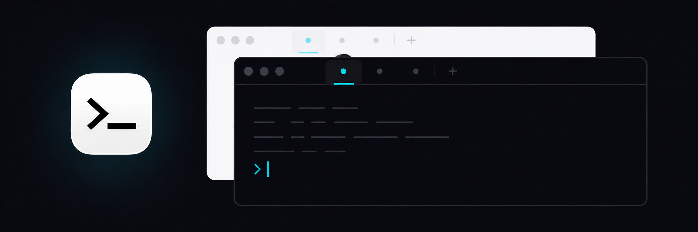
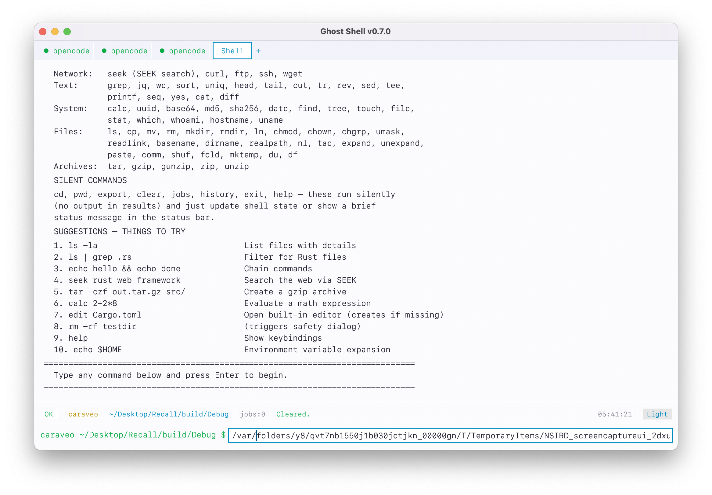

<p align="center">
  
</p>

<h1 align="center">Ghost</h1>

<p align="center">
  A native macOS command shell with built-in tools, responsive terminal emulation, and a focused desktop interface.
</p>

<p align="center">
  
</p>

<p align="center">
  
  
  
</p>

Ghost runs commands in its own macOS window instead of wrapping the Terminal app. Everyday operations can run through its built-in command engine, while interactive programs such as OpenCode and Grok run in dedicated terminal-emulation tabs.

## Quick Install

Download the latest signed universal macOS build from [Releases](https://github.com/Caraveo/ghost/releases/latest), unzip it, and drag **Ghost.app** into **Applications**.

Or install it from Terminal. Because this repository is private, authenticate
the GitHub CLI first with `gh auth login`:

```sh
gh release download --repo Caraveo/ghost --pattern 'Ghost-macOS-universal.zip' --clobber
ditto -x -k Ghost-macOS-universal.zip .
open Ghost.app
```

The release is signed with a Developer ID certificate and supports both Apple Silicon and Intel Macs.

## Highlights

- More than 80 built-in commands for files, text, archives, networking, hashing, and system information
- Responsive terminal emulation that resizes with the window and supports full-screen terminal applications
- Direct terminal input including arrow keys, control sequences, application-cursor mode, and bracketed paste
- Tabbed sessions for the built-in shell and interactive processes
- Command pipelines, redirection, conditionals, background jobs, and environment-variable expansion
- Destructive-command confirmation with a preview of affected files
- Built-in editor with syntax highlighting and save shortcuts
- PATH-aware completion, command history, clickable links, drag and drop, and copyable output
- Git branch and working-tree status in the interface
- Dark Cyan, Matrix, Solarized, Gruvbox, and Light themes
- Native macOS settings and menus

## Development

To build Ghost from source, install the Rust toolchain and Apple command-line developer tools:

```sh
cargo check
cargo test
./build_app.sh
open Ghost.app
```

## Using Ghost

Enter commands in a Shell tab. Standard utilities and Ghost's built-ins render their output in the main pane. Interactive commands open in a terminal-emulation tab and receive the entire content area.

Examples:

```sh
list
findfile "*.rs"
cat Cargo.toml | grep dependencies
echo hello > greeting.txt
git status && cargo check
opencode
grok
```

Natural-language aliases include `list`, `copy`, `move`, `remove`, `print`, `spill`, and `name`.

### Shell syntax

| Syntax | Meaning |
| --- | --- |
| `cmd1 \| cmd2` | Pipe output into another command |
| `cmd > file` | Write output to a file |
| `cmd >> file` | Append output to a file |
| `cmd < file` | Read input from a file |
| `cmd1 && cmd2` | Continue after success |
| `cmd1 \|\| cmd2` | Continue after failure |
| `cmd &` | Start a background job |
| `$VAR`, `${VAR}` | Expand an environment variable |

## Keyboard shortcuts

### Shell and editor

| Shortcut | Action |
| --- | --- |
| `Return` | Run the current command |
| `Tab` | Complete a command or path |
| `↑` / `↓` | Navigate command history |
| `Control-T` | Open a new Shell tab |
| `Control-L` | Clear output |
| `Control-H` | Toggle help |
| `Control-S` | Save the current editor document |
| `Escape` | Cancel or close the active overlay |

### Terminal emulation

When an interactive program is active, Ghost sends text, navigation keys, control combinations, and paste events directly to that process. The terminal grid automatically recalculates its rows and columns whenever the window changes size.

## Architecture

Ghost is written in Rust with [egui](https://github.com/emilk/egui) and [eframe](https://github.com/emilk/egui/tree/master/crates/eframe). Its terminal-emulation layer uses [portable-pty](https://crates.io/crates/portable-pty), with [vt100](https://crates.io/crates/vt100) maintaining terminal screen state. The built-in editor uses [syntect](https://crates.io/crates/syntect) for syntax highlighting, and the native settings window and macOS menu bar are implemented in SwiftUI and AppKit.

```text
src/
├── main.rs        Application entry point and execution loop
├── app.rs         State, tabs, themes, history, and jobs
├── gui.rs         Shell, terminal, editor, settings, and dialogs
├── pty.rs         Terminal-emulation process lifecycle and resizing
├── executor.rs    Command execution and pipelines
├── parser.rs      Shell syntax parser
├── builtins.rs    Built-in command dispatch
├── fileops.rs     File-management commands
├── textproc.rs    Text-processing commands
├── network.rs     Network commands
├── sysutils.rs    System utilities
├── safety.rs      Destructive-operation checks
├── completion.rs  Command and path completion
├── editor.rs      Editor state and syntax highlighting
└── settings.rs    Native settings integration
```

## Safety

Ghost asks for confirmation before commands it recognizes as destructive. This is a guardrail, not a security boundary: commands and terminal applications run with the permissions of the current macOS user. Review commands before approving them.
